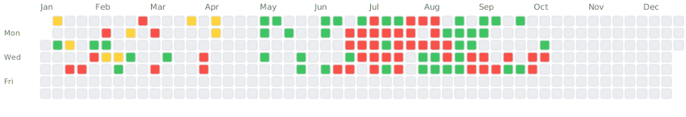

# 📊 IBKR Trading Dashboard

This repository demonstrates the [IBKR Auto-Exporter](https://github.com/jefrnc/ibkr-auto-exporter) GitHub Action in action!

## 🎯 What This Shows

This is a live example of:
- ✅ Automated daily trading data exports from Interactive Brokers
- ✅ Weekly performance summaries
- ✅ Monthly analytics reports
- ✅ Live statistics in README
- ✅ Interactive trading calendar
- ✅ Cost basis filtering for algorithmic trades

<!-- STATS_START -->
### 📊 Live Trading Statistics

| Period | Trades | P&L | Win Rate |
|--------|--------|-----|----------|
| **Week 41 (current)** | 0 | $0.00 | 0.0% |
| Week 40 | 9 | **+$182.31** | 100.0% |
| **October (current)** | 0 | $0.00 | 0.0% |
| September | 0 | $0.00 | 0.0% |

#### 📈 Yearly Projection

| Metric | Actual YTD | Projected EOY |
|--------|------------|---------------|
| **Trades** | 475 | 613 |
| **P&L** | **-$339.76** | **-$438.56** |

*Based on current performance with 82 days remaining*

*Last updated: 2025-10-09 03:16 UTC*
<!-- STATS_END -->

<!-- CALENDAR_START -->
## 📅 2025 Trading Calendar



### Legend
🟩 Profit Day | 🟨 Break Even | 🟥 Loss Day | ⬜ No Trades

### 📊 2025 Statistics

| Metric | Value |
|--------|-------|
| **Total Trading Days** | 93 |
| **Total Trades** | 630 |
| **Total P&L** | $-651.82 |
| **Win Rate** | 37.6% |
| **Profit Days** | 35 (37.6%) |
| **Loss Days** | 48 (51.6%) |
| **Best Day** | $330.31 (2025-05-12) |
| **Worst Day** | $-409.28 (2025-08-12) |
| **Daily Average** | $-7.01 |

### 📈 Monthly Breakdown

| Month | Trades | P&L | Win Rate |
|-------|--------|-----|----------|
| January | 9 | **-$414.66** | 28.6% |
| February | 16 | **+$15.08** | 25.0% |
| March | 4 | **+$52.65** | 25.0% |
| April | 4 | **-$328.44** | 0.0% |
| May | 16 | **+$541.51** | 100.0% |
| June | 74 | **-$262.97** | 50.0% |
| July | 352 | **+$57.07** | 14.3% |
| August | 81 | **+$32.49** | 50.0% |
| September | 72 | **-$352.25** | 38.5% |
| October | 2 | **+$7.70** | 100.0% |

<!-- CALENDAR_END -->

## 🚀 Features Demonstrated

### 1. Automated Exports
Every day at 10 PM EST, this workflow automatically:
- Downloads trading data from IBKR via Flex Web Service
- Processes and organizes trades by date
- Calculates P&L and performance metrics
- Commits to Git for version control

### 2. Data Structure
```
exports/
├── daily/          # Daily trade data
│   └── 2025-07-27.json
├── weekly/         # Weekly summaries
│   └── 2025-W30.json
└── monthly/        # Monthly reports
    └── 2025-07.json
```

### 3. Cost Basis Filtering
This example filters only algorithmic trades with cost basis between $0-$50, perfect for:
- Small position algorithmic trading
- Scalping strategies
- Testing new algorithms with limited risk

## 🔧 Setup Your Own

1. **Fork this repository** or create a new one
2. **Add secrets** to your repository:
   - `IBKR_TOKEN`: Your Flex Web Service token
   - `IBKR_QUERY_ID`: Your Flex Query ID
3. **Configure filtering** (optional) in the workflow
4. **That's it!** Data will start flowing automatically

## 📈 View the Dashboard

*Dashboard coming soon*

## 🔒 Security

- Token-based authentication (no passwords)
- Account numbers automatically obfuscated
- Data stays in your private repository

## 📝 Workflow Configuration

```yaml
name: Export IBKR Trading Data

on:
  schedule:
    - cron: '0 3 * * *'  # Daily at 10 PM EST
  workflow_dispatch:     # Manual trigger

jobs:
  export:
    runs-on: ubuntu-latest
    permissions:
      contents: write
    
    steps:
    - uses: actions/checkout@v3
    
    - uses: jefrnc/ibkr-auto-exporter@v1
      with:
        ibkr-token: ${{ secrets.IBKR_TOKEN }}
        ibkr-query-id: ${{ secrets.IBKR_QUERY_ID }}
        cost-basis-min: '0'
        cost-basis-max: '50'
```

## 🎨 Customization Options

The action supports many parameters:
- `export-path`: Custom directory for exports
- `obfuscate-account`: Privacy mode
- `generate-weekly`: Force weekly summaries
- `generate-monthly`: Force monthly reports
- `cost-basis-min/max`: Filter trades by size

## 📊 Example Data

<details>
<summary>Daily Export Sample</summary>

```json
{
  "exportDate": "2025-07-27 16:00:00",
  "account": "U*****98",
  "date": "2025-07-27",
  "trades": [
    {
      "symbol": "AAPL",
      "side": "BUY",
      "quantity": 1,
      "price": 45.25,
      "pnl": 2.50
    }
  ],
  "summary": {
    "totalTrades": 15,
    "totalPnL": 125.75,
    "winRate": 0.73
  }
}
```
</details>

## 🤝 Contributing

Found a bug or have a suggestion? Please open an issue in the [main repository](https://github.com/jefrnc/ibkr-auto-exporter).

## 📄 License

This example is MIT licensed. The IBKR Auto-Exporter action is also MIT licensed.

---

⭐ If this helps you, please star the [main repository](https://github.com/jefrnc/ibkr-auto-exporter)!

Built with ❤️ using [IBKR Auto-Exporter](https://github.com/jefrnc/ibkr-auto-exporter)